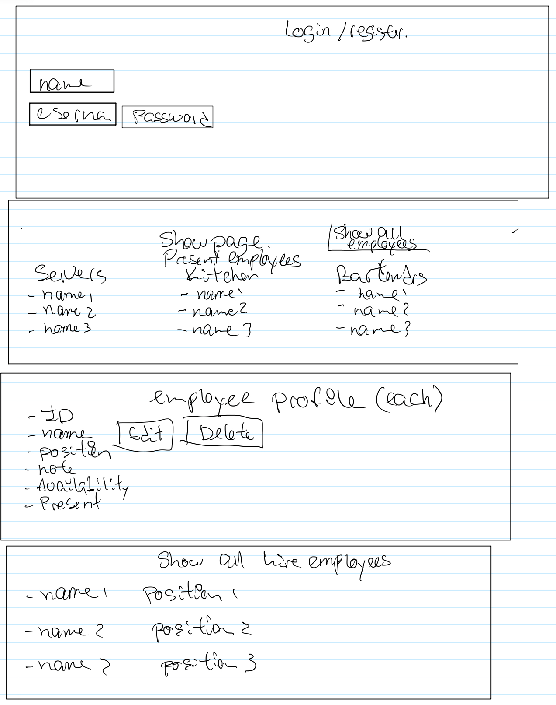
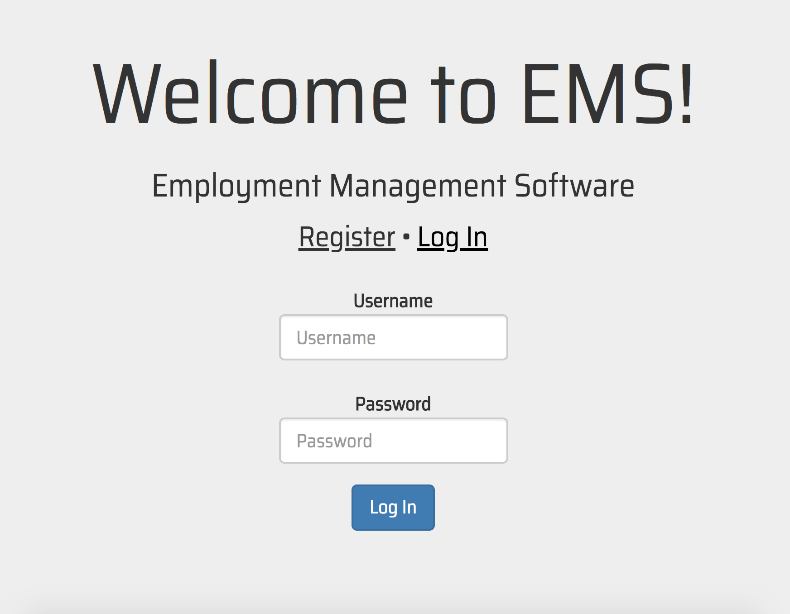
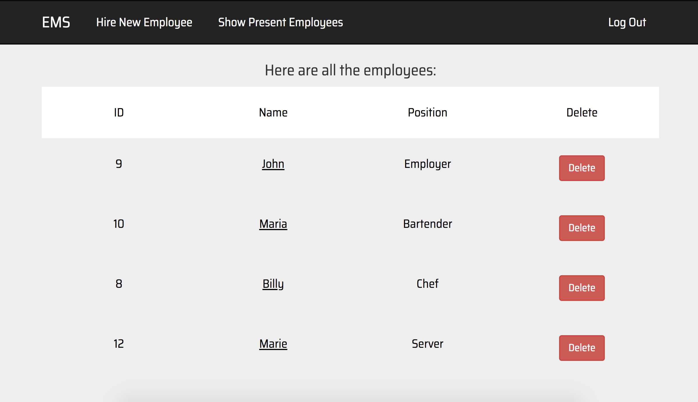
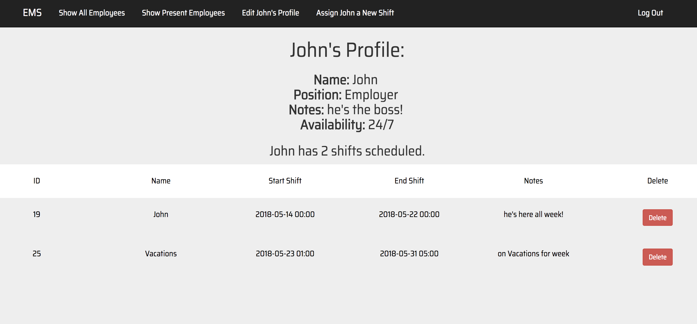

# EMS
Employee Management Software: Manage your employees!

Powered by our API built in Ruby. For more information, consult the API documentation here: https://github.com/irwinx16/project3_api

## User Story

Employer should be able to register and login. 
- Be able to see information of the present employees at the moment of login. 
- Be able to click on each employee and see that employee information
(name, position, notes, availability, and shifts).
- Be able to see all the employees listed by name.
- Be able to edit the information of each employee.
- Be able to add new employees.
- Be able to delete employees. 
- Be able to add shift (breakfast, lunch, dinner, brunch, etc.).
- Be able to assign shifts to employees. 

## Data Tables

Employee Table

- ID
- Name
- Position
- Notes
- Availability
- Working?

Employer Table

- ID
- Name
- Username
- Password
- employee_id

Shift Table

- ID
- Name
- Start
- End
- Notes
- Employee_ID

## Wireframe

## Screenshots

